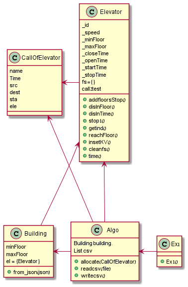

# Elevators - Offline algorithm
###Noamya Shani and Eitan Shankolevski

Our project deals with the optimal choice of elevators for calls in the building, that is, the calculation of the choice of elevator for call should be done in such a way that all calls are made in a minimum time and the average waiting time of each call is minimal.
The algorithm works like this - first of all, we will go through all the available elevators (which have not yet received a task or have already completed the task) and check which of them will perform the task fastest, according to the elevator location (estimated elevator location is done according to Previous) and according to the additional data (stopping time, door opening time ..). If there are no free elevators, we will go through all the elevators and check which elevator will be the 'cheapest' to perform the task ('Cheap' is measured by the time it will take for the elevator to perform the task and by the delay time created for the other readings associated with this elevator).
To calculate the delay time that will be created for the other calls associated with the elevator, we temporarily assigned the task in this elevator and checked the delay time that was created. The task will be embedded in such a location so that it does not lengthen the travel route but only delays it because of the stop (because if we embed the call in a location that will change the direction of travel then it turns out that we extended the elevator time to the previous mission).
The program works like this - the input is a json file that contains building data as well as a csv file that contains elevator call data, and the output is a csv file that contains the exact same elevator call data plus the elevator index selected by our algorithm to perform the task.
We have created a new class called 'Algo' and in fact already in its constructor it gets a json file and csv files, one with the call data and one to write into it the selected elevator indexes, i.e. creating an Algo object with the requested files will run the program alone.

###UML
